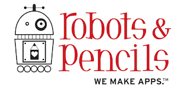

# RPJSContext

RPJSContext adds a bunch of functionality like a CommonJS module implementation (that supports native classes), JavaScript file evaluation and the beginnings of a standard library that you would expect in a browser environment.

[LoDash](https://github.com/lodash/lodash) and [EventEmitter](https://github.com/Wolfy87/EventEmitter) are also bundled for functional utility methods and better events, respectively.

## Usage

To run the example project; clone the repo, and run `pod install` from the Example directory first.

## Requirements

RPJSContext requires at least iOS 7.0 and OS X 10.9.

## Installation

RPJSContext is available through [CocoaPods](http://cocoapods.org), to install
it simply add the following line to your Podfile:

    pod "RPJSContext"

## Contact

## Maintainers

- [Brandon Evans](https://www.github.com/interstateone) ([@interstateone](https://twitter.com/interstateone))

## License

RPJSContext is available under the MIT license. See the LICENSE file for more info.

